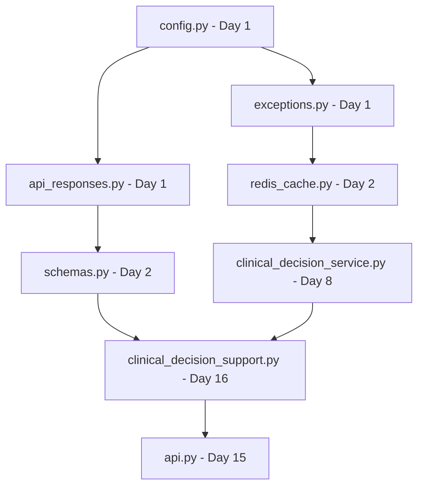

# AI Nurse Florence - Development Implementation Plan

**Version**: 2.1.0  
**Target Timeline**: 7 weeks (49 days)  
**Total Files**: 47 files to implement  
**Architecture**: Service Layer with Conditional Imports Pattern  
**Last Updated**: September 26, 2025

---

## 📊 Current Status Assessment

### ✅ **COMPLETED (Production Ready)**
- Core wizard functionality (treatment plan, SBAR, patient education, clinical trials, disease search)
- Wizard routing with proper `__init__.py` files in `routers/wizards/`
- Basic FastAPI application structure with conditional imports pattern
- Railway deployment with PostgreSQL integration
- All dependencies properly configured in `requirements.txt`
- Health check endpoint: `/api/v1/health`

### 🔄 **IN PROGRESS**
- Railway production deployment monitoring (wizard endpoints coming online)

### 📋 **IMPLEMENTATION REQUIRED**
| Category | Files | Priority |
|----------|-------|----------|
| **Core Infrastructure** | 15 files | Critical |
| **Service Layer** | 8 files | High |
| **Router Layer** | 4 files | High |
| **Frontend Integration** | 4 files | Medium |
| **Testing Suite** | 4 files | High |
| **Documentation** | 12 files | Medium |
| **TOTAL** | **47 files** | |

---

## 🚀 7-Week Development Timeline

### **Phase 1: Foundation Infrastructure (Week 1)**
*Build core utilities that enable all other development*

#### **Days 1-2: Critical Utilities**

**Day 1 - Morning Priority**
1. **`src/utils/config.py`** ⭐ **CRITICAL BLOCKER**
   ```python
   # Pydantic Settings for environment configuration
   # DATABASE_URL, OPENAI_API_KEY, REDIS_URL, CORS_ORIGINS
   # Required by ALL services and routers
   ```
   **Blocks**: Every other implementation

2. **`src/utils/exceptions.py`** ⭐ **CRITICAL BLOCKER**
   ```python
   # ServiceException, ExternalServiceException, ValidationException
   # Standardized error handling patterns
   ```
   **Blocks**: All service implementations

**Day 1 - Afternoon Priority**
3. **`src/utils/api_responses.py`** ⭐ **CRITICAL BLOCKER**
   ```python
   # create_success_response(), create_error_response()
   # Educational banner integration for medical responses
   ```
   **Blocks**: All API endpoints

**Day 2**
4. **`src/utils/redis_cache.py`** ⭐ **HIGH PRIORITY**
   ```python
   # @cached decorator with Redis backend + in-memory fallback
   # Thread-safe caching with RLock, TTL management
   ```
   **Enables**: Service layer caching strategy

5. **`src/models/schemas.py`** ⭐ **HIGH PRIORITY**
   ```python
   # ClinicalDecisionRequest/Response, SBARRequest/Response
   # Educational banners in all medical models
   ```
   **Blocks**: All router input/output validation

#### **Days 3-4: Security & Integration**

**Day 3**
6. **`src/utils/middleware.py`** ⭐ **HIGH PRIORITY**
   ```python
   # SecurityHeadersMiddleware (CSP, HSTS)
   # RequestIdMiddleware, LoggingMiddleware
   ```
   **Enables**: Production security compliance

7. **`src/models/database.py`** 🔶 **MEDIUM PRIORITY**
   ```python
   # Async SQLAlchemy session management
   # User, Session, WizardState models
   ```
   **Note**: Can be stubbed initially

**Day 4**
8. **`src/services/openai_client.py`** ⭐ **HIGH PRIORITY**
   ```python
   # Lazy OpenAI client with conditional loading
   # get_openai_client() returns None if API key missing
   ```
   **Blocks**: Clinical AI functionality

#### **Days 5-7: Package Structure**

**Days 5-7**
9. **`src/services/__init__.py`** 🔶 **MEDIUM PRIORITY**
10. **`src/routers/__init__.py`** 🔶 **MEDIUM PRIORITY**
11. **`src/utils/__init__.py`** 🔶 **MEDIUM PRIORITY**
12. **`src/models/__init__.py`** 🔶 **MEDIUM PRIORITY**

**Week 1 Success Criteria:**
- [ ] All utilities import without errors
- [ ] Configuration loads from environment
- [ ] Error handling works across components
- [ ] Caching decorator functional with fallback

---

### **Phase 2: Service Layer Implementation (Week 2)**
*Business logic and external integrations*

#### **Days 8-10: Core Clinical Services**

**Day 8**
13. **`src/services/clinical_decision_service.py`** ⭐ **HIGH PRIORITY**
    ```python
    # Evidence-based nursing interventions
    # Risk assessment integration
    # Core business logic for clinical endpoints
    ```
    **Enables**: Main clinical functionality

**Day 9**
14. **`src/services/evidence_service.py`** ⭐ **HIGH PRIORITY**
    ```python
    # PubMed integration with conditional loading
    # Clinical guidelines access with @cached decorator
    ```
    **Enables**: Literature-backed recommendations

**Day 10**
15. **`src/services/model_selector.py`** 🔶 **MEDIUM PRIORITY**
16. **`src/services/prompt_enhancement.py`** 🔶 **MEDIUM PRIORITY**
    ```python
    # Context-aware model selection, query enhancement
    # Can use simple fallbacks initially
    ```

#### **Days 11-12: Supporting Services**

**Day 11**
17. **`src/services/document_authoring_service.py`** 🔶 **MEDIUM PRIORITY**
    ```python
    # SBAR report generation, care plan templates
    # Multi-step wizard workflow support
    ```

**Day 12**
18. **`src/services/risk_assessment_service.py`** 🔶 **MEDIUM PRIORITY**
    ```python
    # Morse Falls Scale, Braden Scale, MEWS
    # Cached clinical risk calculations
    ```

#### **Days 13-14: Testing Foundation**

**Day 13**
19. **`tests/__init__.py`** ⭐ **HIGH PRIORITY**
20. **Enhanced `tests/conftest.py`** ⭐ **HIGH PRIORITY**
    ```python
    # Service layer fixtures, external API mocks
    # PubMed, clinical guidelines mocking
    ```

**Day 14**
21. **`tests/test_clinical_services.py`** ⭐ **HIGH PRIORITY**
    ```python
    # Service layer unit tests with fixture-based mocking
    # Caching strategy validation
    ```

**Week 2 Success Criteria:**
- [ ] Clinical decision service generates interventions
- [ ] External service integration with fallbacks
- [ ] Caching strategy operational
- [ ] Service layer >80% test coverage

---

### **Phase 3: API Layer & Routing (Week 3)**
*Expose services through REST endpoints*

#### **Days 15-16: Core API Infrastructure**

**Day 15**
22. **`src/routers/api.py`** ⭐ **HIGH PRIORITY**
    ```python
    # Main API router with conditional imports
    # Include clinical, wizards, ChatGPT Store routers
    ```
    **Enables**: Centralized API routing

**Day 16**
23. **`src/routers/clinical_decision_support.py`** ⭐ **HIGH PRIORITY**
    ```python
    # /clinical-decision-support/interventions endpoint
    # /clinical-decision-support/risk-assessment/{type}
    # Service layer integration with error handling
    ```
    **Delivers**: Core clinical API functionality

#### **Days 17-18: Enhanced Documentation**

**Day 17**
24. **`src/utils/swagger_enhancements.py`** 🔶 **MEDIUM PRIORITY**
    ```python
    # Enhanced OpenAPI schema for healthcare
    # Clinical examples, custom theme integration
    ```

**Day 18**
25. **`src/routers/ui.py`** 🔶 **MEDIUM PRIORITY**
    ```python
    # Progressive enhancement endpoints
    # Template rendering, React component routes
    ```

#### **Days 19-21: Testing & Integration**

**Days 19-21**
26. **Enhanced API Testing** ⭐ **HIGH PRIORITY**
    ```python
    # Integration tests for all endpoints
    # OpenAPI schema validation
    # Error handling verification
    ```

**Week 3 Success Criteria:**
- [ ] Core clinical endpoints functional
- [ ] Enhanced Swagger UI with healthcare theme
- [ ] API integration tests passing
- [ ] Progressive enhancement templates working

---

### **Phase 4: ChatGPT Store Integration (Week 4)**
*Enterprise healthcare access*

#### **Days 22-23: Authentication Infrastructure**

**Day 22**
27. **`src/utils/chatgpt_store.py`** 🔶 **MEDIUM PRIORITY**
    ```python
    # ChatGPTStoreAuth with OAuth2 + JWT patterns
    # Professional license validation logic
    ```

**Day 23**
28. **`src/services/chatgpt_store_service.py`** 🔶 **MEDIUM PRIORITY**
    ```python
    # Enterprise integration service
    # Institution-specific customization
    ```

#### **Days 24-25: Enterprise Endpoints**

**Day 24**
29. **`src/routers/chatgpt_store.py`** 🔶 **MEDIUM PRIORITY**
    ```python
    # /chatgpt-store/clinical-interventions
    # /chatgpt-store/verify-professional
    # Professional authentication required
    ```

**Day 25**
30. **`tests/test_chatgpt_integration.py`** 🔶 **MEDIUM PRIORITY**
    ```python
    # OAuth2 + JWT authentication tests
    # Professional license validation tests
    # pytest.mark.integration markers
    ```

#### **Days 26-28: Documentation**

**Days 26-28**
31. **`docs/deployment/chatgpt-store-setup.md`** 🔵 **LOW PRIORITY**
    ```markdown
    # Enterprise healthcare access configuration
    # Professional authentication setup guide
    ```

**Week 4 Success Criteria:**
- [ ] ChatGPT Store authentication functional
- [ ] Professional license validation working
- [ ] Institution-specific responses implemented
- [ ] Enterprise endpoints documented

---

### **Phase 5: Frontend Integration (Week 5)**
*Progressive enhancement and React components*

#### **Days 29-30: Static Assets**

**Day 29**
32. **`src/static/css/clinical-swagger.css`** 🔶 **MEDIUM PRIORITY**
    ```css
    /* Healthcare color palette: --clinical-primary: #2563eb */
    /* React component styles, mobile responsiveness */
    /* Print styles for clinical documentation */
    ```

**Day 30**
33. **`src/static/js/clinical-components.js`** 🔶 **MEDIUM PRIORITY**
    ```javascript
    // ClinicalDecisionWidget, SBARWizard classes
    // Graceful degradation when React unavailable
    // Conditional React loading pattern
    ```

#### **Days 31-32: HTML Templates**

**Day 31**
34. **`src/templates/clinical_decision.html`** 🔵 **LOW PRIORITY**
    ```html
    <!-- Evidence-based interventions interface -->
    <!-- React component integration with data-clinical-widget -->
    <!-- No-JavaScript fallback interface -->
    ```

**Day 32**
35. **`src/templates/sbar_wizard.html`** 🔵 **LOW PRIORITY**
    ```html
    <!-- Multi-step clinical documentation interface -->
    <!-- SBAR wizard React component integration -->
    ```

#### **Days 33-35: Enhanced Application**

**Day 33**
36. **`src/app_enhanced.py`** 🔵 **LOW PRIORITY**
    ```python
    # Enhanced FastAPI with React integration
    # Static file serving, conditional loading
    ```

**Days 34-35**
37. **`tests/test_react_components.py`** 🔶 **MEDIUM PRIORITY**
    ```python
    # Frontend integration tests
    # Progressive enhancement validation
    ```

**Week 5 Success Criteria:**
- [ ] React components with graceful degradation
- [ ] Mobile-responsive healthcare UI
- [ ] Progressive enhancement complete
- [ ] Static asset serving optimized

---

### **Phase 6: Testing & Quality Assurance (Week 6)**
*Comprehensive test coverage and performance*

#### **Days 36-38: Integration Testing**

**Days 36-37**
38. **Enhanced Integration Test Suite**
    ```python
    # End-to-end workflow testing
    # External service integration validation
    # Caching performance testing
    ```

**Day 38**
39. **Performance & Load Testing**
    ```python
    # API endpoint performance benchmarking
    # Memory usage profiling
    # Database query optimization
    ```

#### **Days 39-42: Documentation Testing**

**Days 39-42**
40. **Documentation Validation**
    ```python
    # API documentation accuracy verification
    # Code example testing
    # Installation guide validation
    ```

**Week 6 Success Criteria:**
- [ ] >90% test coverage across components
- [ ] Integration tests passing consistently
- [ ] Performance benchmarks established
- [ ] Documentation examples verified

---

### **Phase 7: Documentation & Production (Week 7)**
*Complete documentation and deployment preparation*

#### **Days 43-45: Technical Documentation**

**Day 43**
41. **`docs/technical/architecture-overview.md`** 🔶 **MEDIUM PRIORITY**
    ```markdown
    # System architecture with diagrams
    # Service Layer Architecture explanation
    # Conditional imports pattern examples
    ```

**Day 44**
42. **`docs/technical/api-documentation.md`** 🔶 **MEDIUM PRIORITY**
    ```markdown
    # Comprehensive endpoint documentation
    # Clinical workflow examples
    # Authentication patterns
    ```

**Day 45**
43. **Enhanced `docs/technical/technical-specification.md`**
    ```markdown
    # Complete technical specification
    # React integration strategy
    # ChatGPT Store deployment procedures
    ```

#### **Days 46-47: Clinical Documentation**

**Day 46**
44. **`docs/clinical/clinical-workflows.md`** 🔶 **MEDIUM PRIORITY**
    ```markdown
    # Evidence-based decision support workflows
    # Wizard pattern implementation
    # Clinical safety guidelines
    ```

**Day 47**
45. **Complete Clinical Documentation Suite**
    ```markdown
    # Evidence standards, safety guidelines
    # Clinical validation procedures
    # Professional use disclaimers
    ```

#### **Days 48-49: Final Deployment**

**Days 48-49**
46. **Production Deployment & Validation**
    ```bash
    # Railway deployment with enhanced features
    # ChatGPT Store integration testing
    # Performance monitoring setup
    ```

**Week 7 Success Criteria:**
- [ ] Complete documentation suite published
- [ ] Production deployment with all features
- [ ] ChatGPT Store integration live
- [ ] Performance monitoring operational

---

## 📋 Daily Implementation Workflow

### **Morning Setup**
```bash
cd /Users/patrickroebuck/projects/ai-nurse-florence
./run_dev.sh  # Automated setup following coding instructions
git pull origin main
```

### **Implementation Standards Checklist**
For each file, ensure:
- ✅ **Conditional Imports Pattern**: Graceful degradation when dependencies missing
- ✅ **Service Layer Architecture**: Clear separation of concerns
- ✅ **Caching Strategy**: `@cached` decorator with Redis + in-memory fallback
- ✅ **Error Handling**: Custom exceptions with standardized responses
- ✅ **Educational Banners**: All medical content includes safety disclaimers
- ✅ **API Design Standards**: Comprehensive OpenAPI documentation
- ✅ **Testing Patterns**: Fixture-based mocking with type safety

### **Quality Gates**
```bash
# After implementing each file:
python -c "import src.utils.config"  # Test imports
pytest tests/unit/test_[component].py  # Unit tests
pytest -ra  # Show all test output
git add . && git commit -m "feat: implement [component] following coding instructions"
```

### **End of Day**
```bash
pytest  # Full test suite
git status && git push origin main  # Push daily progress
```

---

## 🎯 Critical Dependencies Map



**Critical Path**: `config.py` → `exceptions.py` → `api_responses.py` → `schemas.py` → Services → Routers → Main API

---

## 📊 Progress Tracking

### **Weekly Goals Checklist**

#### **Week 1: Foundation** ✅/❌
- [ ] Core utilities enable all other development
- [ ] Configuration management operational
- [ ] Error handling standardized
- [ ] Caching strategy implemented

#### **Week 2: Services** ✅/❌
- [ ] Clinical decision support fully functional
- [ ] External service integration working
- [ ] Service layer test coverage >80%
- [ ] OpenAI integration with fallbacks

#### **Week 3: APIs** ✅/❌
- [ ] All core endpoints documented and tested
- [ ] Enhanced Swagger UI with healthcare theme
- [ ] Progressive enhancement templates
- [ ] API integration tests passing

#### **Week 4: Enterprise** ✅/❌
- [ ] ChatGPT Store authentication working
- [ ] Professional license validation
- [ ] Institution-specific responses
- [ ] Enterprise endpoints tested

#### **Week 5: Frontend** ✅/❌
- [ ] React components with graceful degradation
- [ ] Mobile-responsive healthcare UI
- [ ] Progressive enhancement complete
- [ ] Static asset serving optimized

#### **Week 6: Testing** ✅/❌
- [ ] Comprehensive test coverage >90%
- [ ] Integration tests reliable
- [ ] Performance benchmarks established
- [ ] Load testing completed

#### **Week 7: Production** ✅/❌
- [ ] Complete documentation suite
- [ ] Production deployment successful
- [ ] ChatGPT Store integration live
- [ ] Monitoring and alerts operational

---

## 🚨 Blocker Resolution Guide

### **Config.py Import Errors (Day 1)**
**Symptoms**: Import errors across all components  
**Resolution**:
1. Verify `.env` file exists with required variables
2. Check Pydantic installation: `pip install pydantic[dotenv]`
3. Test minimal config: `python -c "from pydantic import BaseSettings"`

### **External API Failures (Days 8-9)**
**Symptoms**: Service tests failing, timeout errors  
**Resolution**:
1. Verify conditional imports: services return stub responses
2. Check network connectivity and API keys
3. Enable fallback responses in service implementations

### **React Components Not Loading (Days 29-30)**
**Symptoms**: Frontend showing fallback forms  
**Resolution**:
1. Verify static file serving: `/static/js/clinical-components.js` accessible
2. Test graceful degradation: ensure fallback forms work
3. Check React CDN availability and browser console errors

### **ChatGPT Store Auth Failures (Days 22-23)**
**Symptoms**: 401 errors on enterprise endpoints  
**Resolution**:
1. Verify JWT token validation logic
2. Check test credentials and mock authentication
3. Implement fallback to basic authentication for development

---

## 📈 Success Metrics

### **Technical Metrics**
- **Test Coverage**: >90% across all components
- **API Response Time**: <200ms cached, <2s external APIs
- **Error Rate**: <1% for all endpoints
- **Uptime**: >99.5% for Railway deployment

### **Feature Completeness**
- **Clinical Decision Support**: Evidence-based interventions with literature references
- **Risk Assessment**: Morse Falls Scale, Braden Scale, MEWS fully functional
- **Document Generation**: SBAR reports, care plans with clinical validation
- **Progressive Enhancement**: React components with graceful HTML fallbacks

### **User Experience**
- **Mobile Responsiveness**: All interfaces functional on mobile devices
- **Accessibility**: WCAG 2.1 AA compliance for clinical interfaces
- **Performance**: Sub-second response times for clinical decisions
- **Educational Value**: All medical responses include evidence levels and safety disclaimers

---

## 🎯 Next Steps

1. **Start with Day 1**: Implement `src/utils/config.py` as foundation
2. **Save this plan**: Reference document in project root as `DEVELOPMENT_PLAN.md`
3. **Daily updates**: Track progress against weekly goals
4. **Quality gates**: Ensure each phase meets success criteria before proceeding

**🎯 Start Date**: _[Insert Date]_  
**✅ Completion Target**: 7 weeks from start date  
**📋 Update Frequency**: Daily progress, weekly milestone reviews

This plan provides clear daily objectives, dependency management, and quality gates to ensure successful implementation of the complete AI Nurse Florence enhanced feature set following all coding instructions

