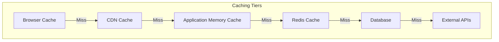

# Caching Strategy
## Redis caching with in-memory fallback patterns

## Overview

AI Nurse Florence implements a multi-tier caching strategy to optimize performance, reduce external API costs, and ensure system resilience. The architecture uses Redis as the primary cache with automatic fallback to in-memory caching when Redis is unavailable.

## Architecture



## Implementation

### Core Caching Decorator

```python
# utils/redis_cache.py
from functools import wraps
from typing import Optional, Any, Callable
import hashlib
import json
import time
from threading import RLock

class CacheManager:
    """
    Multi-tier cache manager with Redis primary and memory fallback
    """
    
    def __init__(self):
        self.redis_client = self._init_redis()
        self.memory_cache = {}
        self.cache_lock = RLock()
        self.ttl_tracker = {}
    
    def _init_redis(self) -> Optional[redis.Redis]:
        """Initialize Redis connection with fallback"""
        try:
            if os.getenv("AI_NURSE_DISABLE_REDIS") == "1":
                return None
                
            client = redis.from_url(
                os.getenv("REDIS_URL", "redis://localhost:6379"),
                decode_responses=True,
                socket_connect_timeout=5,
                socket_keepalive=True,
                socket_keepalive_options={
                    1: 1,  # TCP_KEEPIDLE
                    2: 2,  # TCP_KEEPINTVL
                    3: 3,  # TCP_KEEPCNT
                }
            )
            client.ping()
            return client
        except Exception as e:
            logger.warning(f"Redis unavailable: {e}. Using memory cache.")
            return None
    
    def get(self, key: str) -> Optional[Any]:
        """Get from cache with tier traversal"""
        # Try Redis first
        if self.redis_client:
            try:
                value = self.redis_client.get(key)
                if value:
                    return json.loads(value)
            except Exception:
                pass
        
        # Fallback to memory cache
        with self.cache_lock:
            if key in self.memory_cache:
                # Check TTL
                if key in self.ttl_tracker:
                    if time.time() > self.ttl_tracker[key]:
                        del self.memory_cache[key]
                        del self.ttl_tracker[key]
                        return None
                return self.memory_cache[key]
        
        return None
    
    def set(self, key: str, value: Any, ttl: int = 3600) -> bool:
        """Set in cache with write-through"""
        # Set in Redis
        success = False
        if self.redis_client:
            try:
                self.redis_client.setex(
                    key, 
                    ttl, 
                    json.dumps(value, default=str)
                )
                success = True
            except Exception as e:
                logger.warning(f"Redis set failed: {e}")
        
        # Always set in memory cache as fallback
        with self.cache_lock:
            self.memory_cache[key] = value
            self.ttl_tracker[key] = time.time() + min(ttl, 300)  # Max 5 min in memory
            
            # Implement LRU eviction if memory cache too large
            if len(self.memory_cache) > 1000:
                self._evict_lru()
        
        return success
    
    def delete(self, key: str) -> bool:
        """Delete from all cache tiers"""
        success = False
        
        # Delete from Redis
        if self.redis_client:
            try:
                self.redis_client.delete(key)
                success = True
            except Exception:
                pass
        
        # Delete from memory
        with self.cache_lock:
            if key in self.memory_cache:
                del self.memory_cache[key]
                if key in self.ttl_tracker:
                    del self.ttl_tracker[key]
                success = True
        
        return success
    
    def _evict_lru(self):
        """Simple LRU eviction for memory cache"""
        if len(self.memory_cache) <= 800:
            return
            
        # Remove expired entries first
        current_time = time.time()
        expired_keys = [
            k for k, exp_time in self.ttl_tracker.items() 
            if exp_time < current_time
        ]
        
        for key in expired_keys:
            del self.memory_cache[key]
            del self.ttl_tracker[key]
        
        # If still too large, remove oldest entries
        if len(self.memory_cache) > 800:
            sorted_keys = sorted(
                self.ttl_tracker.items(), 
                key=lambda x: x[1]
            )
            for key, _ in sorted_keys[:200]:
                del self.memory_cache[key]
                del self.ttl_tracker[key]

# Singleton instance
cache_manager = CacheManager()

def cached(ttl_seconds: int = 3600, key_prefix: str = None):
    """
    Decorator for caching function results
    
    Args:
        ttl_seconds: Time to live in seconds
        key_prefix: Optional prefix for cache keys
    """
    def decorator(func: Callable) -> Callable:
        @wraps(func)
        async def async_wrapper(*args, **kwargs):
            # Generate cache key
            cache_key = _generate_cache_key(
                func.__name__, 
                args, 
                kwargs, 
                key_prefix
            )
            
            # Try to get from cache
            cached_value = cache_manager.get(cache_key)
            if cached_value is not None:
                logger.debug(f"Cache hit: {cache_key}")
                return cached_value
            
            # Execute function
            result = await func(*args, **kwargs)
            
            # Cache result
            cache_manager.set(cache_key, result, ttl_seconds)
            logger.debug(f"Cached: {cache_key} for {ttl_seconds}s")
            
            return result
        
        @wraps(func)
        def sync_wrapper(*args, **kwargs):
            # Generate cache key
            cache_key = _generate_cache_key(
                func.__name__, 
                args, 
                kwargs, 
                key_prefix
            )
            
            # Try to get from cache
            cached_value = cache_manager.get(cache_key)
            if cached_value is not None:
                return cached_value
            
            # Execute function
            result = func(*args, **kwargs)
            
            # Cache result
            cache_manager.set(cache_key, result, ttl_seconds)
            
            return result
        
        # Return appropriate wrapper
        if asyncio.iscoroutinefunction(func):
            return async_wrapper
        else:
            return sync_wrapper
    
    return decorator

def _generate_cache_key(
    func_name: str, 
    args: tuple, 
    kwargs: dict, 
    prefix: str = None
) -> str:
    """Generate deterministic cache key"""
    key_parts = [prefix or "cache", func_name]
    
    # Add args to key
    for arg in args:
        if hasattr(arg, '__dict__'):
            key_parts.append(str(arg.__dict__))
        else:
            key_parts.append(str(arg))
    
    # Add kwargs to key
    for k, v in sorted(kwargs.items()):
        key_parts.append(f"{k}={v}")
    
    # Generate hash for long keys
    key_str = ":".join(key_parts)
    if len(key_str) > 250:
        key_hash = hashlib.md5(key_str.encode()).hexdigest()
        return f"{prefix or 'cache'}:{func_name}:{key_hash}"
    
    return key_str
```

## Caching Strategies by Service

### Medical API Responses

```python
# services/disease_service.py
from utils.redis_cache import cached

class DiseaseService:
    
    @cached(ttl_seconds=86400, key_prefix="disease")  # 24-hour cache
    async def lookup_disease(self, disease_name: str) -> dict:
        """
        Disease information with long TTL (changes infrequently)
        """
        return await self._fetch_from_mydisease(disease_name)
    
    @cached(ttl_seconds=3600, key_prefix="symptoms")  # 1-hour cache
    async def get_symptoms(self, disease_id: str) -> list:
        """
        Symptom data with medium TTL
        """
        return await self._fetch_symptoms(disease_id)
```

### Literature Search Results

```python
# services/pubmed_service.py
from utils.redis_cache import cached

class PubMedService:
    
    @cached(ttl_seconds=3600, key_prefix="pubmed")  # 1-hour cache
    async def search_literature(
        self, 
        query: str, 
        max_results: int = 10
    ) -> list:
        """
        PubMed search with medium TTL (new articles published frequently)
        """
        return await self._search_pubmed(query, max_results)
    
    @cached(ttl_seconds=604800, key_prefix="article")  # 1-week cache
    async def get_article_details(self, pmid: str) -> dict:
        """
        Article details with long TTL (published articles don't change)
        """
        return await self._fetch_article(pmid)
```

### Clinical Trials

```python
# services/trials_service.py
from utils.redis_cache import cached

class ClinicalTrialsService:
    
    @cached(ttl_seconds=21600, key_prefix="trials")  # 6-hour cache
    async def search_trials(
        self, 
        condition: str, 
        status: str = None
    ) -> list:
        """
        Clinical trials with medium TTL (status updates periodically)
        """
        return await self._search_clinicaltrials(condition, status)
```

### AI-Generated Content

```python
# services/openai_service.py
from utils.redis_cache import cached

class OpenAIService:
    
    @cached(ttl_seconds=3600, key_prefix="ai_summary")  # 1-hour cache
    async def generate_summary(
        self, 
        text: str, 
        max_length: int = 500
    ) -> str:
        """
        AI summaries with short TTL (context-dependent)
        """
        # Cache based on text hash, not full text
        cache_key = hashlib.md5(text.encode()).hexdigest()
        return await self._generate_with_gpt(text, max_length)
    
    # Treatment plans are NOT cached (patient-specific)
    async def generate_treatment_plan(self, wizard_data: dict) -> str:
        """
        No caching for patient-specific content
        """
        return await self._generate_plan(wizard_data)
```

## Cache Warming

### Startup Cache Warming

```python
# utils/cache_warmer.py
import asyncio
from typing import List

class CacheWarmer:
    """
    Pre-populate cache with commonly accessed data
    """
    
    def __init__(self):
        self.common_diseases = [
            "diabetes", "hypertension", "asthma", 
            "copd", "heart failure", "pneumonia"
        ]
        self.common_queries = [
            "covid-19 treatment", "insulin therapy",
            "blood pressure management"
        ]
    
    async def warm_cache(self):
        """
        Warm cache on application startup
        """
        tasks = []
        
        # Warm disease cache
        for disease in self.common_diseases:
            tasks.append(self._warm_disease_cache(disease))
        
        # Warm literature cache
        for query in self.common_queries:
            tasks.append(self._warm_pubmed_cache(query))
        
        # Execute all warming tasks
        results = await asyncio.gather(*tasks, return_exceptions=True)
        
        successful = sum(1 for r in results if not isinstance(r, Exception))
        logger.info(f"Cache warming complete: {successful}/{len(tasks)} successful")
    
    async def _warm_disease_cache(self, disease: str):
        from services.disease_service import disease_service
        await disease_service.lookup_disease(disease)
    
    async def _warm_pubmed_cache(self, query: str):
        from services.pubmed_service import pubmed_service
        await pubmed_service.search_literature(query, max_results=5)

# Run on startup
@app.on_event("startup")
async def startup_cache_warming():
    if os.getenv("ENABLE_CACHE_WARMING", "true").lower() == "true":
        warmer = CacheWarmer()
        asyncio.create_task(warmer.warm_cache())
```

## Cache Invalidation

### Manual Invalidation

```python
# utils/cache_invalidation.py
class CacheInvalidator:
    """
    Cache invalidation strategies
    """
    
    def invalidate_pattern(self, pattern: str):
        """
        Invalidate all keys matching pattern
        """
        if cache_manager.redis_client:
            try:
                # Use SCAN to avoid blocking
                cursor = 0
                while True:
                    cursor, keys = cache_manager.redis_client.scan(
                        cursor, 
                        match=pattern, 
                        count=100
                    )
                    if keys:
                        cache_manager.redis_client.delete(*keys)
                    if cursor == 0:
                        break
            except Exception as e:
                logger.error(f"Pattern invalidation failed: {e}")
        
        # Also clear from memory cache
        with cache_manager.cache_lock:
            keys_to_delete = [
                k for k in cache_manager.memory_cache 
                if pattern.replace('*', '') in k
            ]
            for key in keys_to_delete:
                del cache_manager.memory_cache[key]
    
    def invalidate_service(self, service_name: str):
        """
        Invalidate all cache for a service
        """
        self.invalidate_pattern(f"{service_name}:*")
    
    def invalidate_all(self):
        """
        Clear all caches (use with caution)
        """
        if cache_manager.redis_client:
            try:
                cache_manager.redis_client.flushdb()
            except Exception:
                pass
        
        with cache_manager.cache_lock:
            cache_manager.memory_cache.clear()
            cache_manager.ttl_tracker.clear()
```

### Automatic Invalidation

```python
# Invalidate on data updates
@router.post("/admin/refresh-disease-cache")
async def refresh_disease_cache(disease_name: str):
    """
    Admin endpoint to refresh disease cache
    """
    invalidator = CacheInvalidator()
    invalidator.invalidate_pattern(f"disease:{disease_name}:*")
    
    # Re-warm cache
    from services.disease_service import disease_service
    result = await disease_service.lookup_disease(disease_name)
    
    return {"status": "refreshed", "disease": disease_name}
```

## Performance Metrics

### Cache Hit Ratio Monitoring

```python
# utils/cache_metrics.py
from prometheus_client import Counter, Gauge, Histogram

# Metrics
cache_hits = Counter('cache_hits_total', 'Total cache hits', ['cache_type'])
cache_misses = Counter('cache_misses_total', 'Total cache misses', ['cache_type'])
cache_hit_ratio = Gauge('cache_hit_ratio', 'Cache hit ratio', ['cache_type'])
cache_operation_duration = Histogram(
    'cache_operation_duration_seconds',
    'Cache operation duration',
    ['operation', 'cache_type']
)

class CacheMetrics:
    """
    Track cache performance metrics
    """
    
    def record_hit(self, cache_type: str = "redis"):
        cache_hits.labels(cache_type=cache_type).inc()
        self._update_hit_ratio(cache_type)
    
    def record_miss(self, cache_type: str = "redis"):
        cache_misses.labels(cache_type=cache_type).inc()
        self._update_hit_ratio(cache_type)
    
    def _update_hit_ratio(self, cache_type: str):
        hits = cache_hits.labels(cache_type=cache_type)._value.get()
        misses = cache_misses.labels(cache_type=cache_type)._value.get()
        total = hits + misses
        
        if total > 0:
            ratio = hits / total
            cache_hit_ratio.labels(cache_type=cache_type).set(ratio)
```

## Configuration

### Environment Variables

```bash
# Redis Configuration
REDIS_URL=redis://localhost:6379/0
REDIS_MAX_CONNECTIONS=50
REDIS_SOCKET_KEEPALIVE=1
REDIS_SOCKET_CONNECT_TIMEOUT=5
REDIS_DECODE_RESPONSES=1

# Cache Configuration
CACHE_DEFAULT_TTL=3600
CACHE_MAX_MEMORY_ITEMS=1000
CACHE_ENABLE_COMPRESSION=1
CACHE_KEY_PREFIX=florence

# Cache Warming
ENABLE_CACHE_WARMING=true
CACHE_WARM_ON_STARTUP=true

# Fallback Configuration
AI_NURSE_DISABLE_REDIS=0  # Set to 1 to force memory-only
MEMORY_CACHE_MAX_SIZE=1000
MEMORY_CACHE_TTL_MAX=300
```

### TTL Strategy

| Content Type | TTL | Rationale |
|-------------|-----|-----------|
| Disease Information | 24 hours | Rarely changes |
| PubMed Articles | 1 week | Published articles static |
| PubMed Searches | 1 hour | New articles published |
| Clinical Trials | 6 hours | Status updates periodically |
| AI Summaries | 1 hour | Context-dependent |
| Patient Education | 12 hours | Relatively static |
| Risk Assessments | 30 minutes | Patient-specific |
| Treatment Plans | No cache | Patient-specific |
| Health Check | 30 seconds | System status |

## Testing Cache

### Unit Tests

```python
# tests/test_cache.py
import pytest
from utils.redis_cache import cache_manager, cached

@pytest.fixture
def clear_cache():
    """Clear all caches before test"""
    cache_manager.delete("*")
    yield
    cache_manager.delete("*")

def test_cache_fallback(clear_cache, monkeypatch):
    """Test fallback to memory when Redis unavailable"""
    # Disable Redis
    monkeypatch.setenv("AI_NURSE_DISABLE_REDIS", "1")
    
    # Reinitialize cache manager
    cache_manager.__init__()
    
    # Test memory cache works
    cache_manager.set("test_key", "test_value", ttl=60)
    assert cache_manager.get("test_key") == "test_value"

@pytest.mark.asyncio
async def test_cached_decorator(clear_cache):
    """Test caching decorator"""
    call_count = 0
    
    @cached(ttl_seconds=60)
    async def expensive_function(param: str) -> str:
        nonlocal call_count
        call_count += 1
        return f"result_{param}"
    
    # First call - cache miss
    result1 = await expensive_function("test")
    assert result1 == "result_test"
    assert call_count == 1
    
    # Second call - cache hit
    result2 = await expensive_function("test")
    assert result2 == "result_test"
    assert call_count == 1  # No additional call

def test_cache_eviction(clear_cache):
    """Test LRU eviction"""
    # Fill cache beyond limit
    for i in range(1200):
        cache_manager.set(f"key_{i}", f"value_{i}", ttl=300)
    
    # Check cache size is limited
    assert len(cache_manager.memory_cache) <= 1000
```

## Best Practices

1. **Cache Keys**: Use consistent, deterministic key generation
2. **TTL Values**: Set appropriate TTL based on data volatility
3. **Cache Levels**: Use multiple cache tiers for resilience
4. **Monitoring**: Track hit rates and adjust strategies
5. **Invalidation**: Clear cache when data updates
6. **Compression**: Consider compressing large cached values
7. **Security**: Don't cache sensitive/personal data
8. **Testing**: Test with and without cache
9. **Documentation**: Document cache dependencies
10. **Gradual Rollout**: Test cache changes in staging first

---

**Caching Version**: 1.0.0  
**Last Updated**: September 2025  
**Performance Target**: >90% hit rate for common queries
