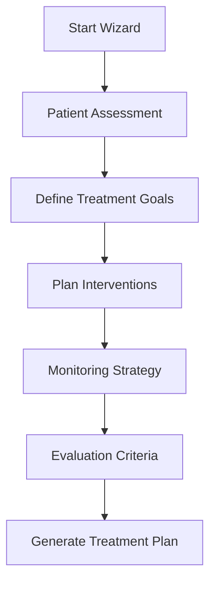
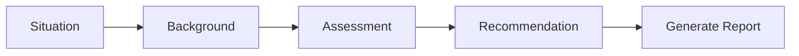
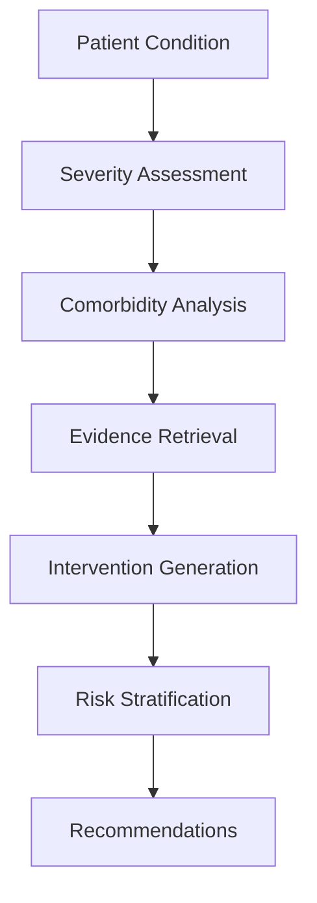
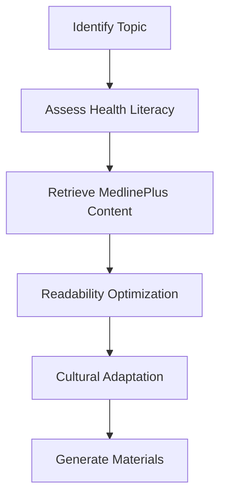

# Clinical Workflows Documentation
## Evidence-based clinical decision support workflows

## Overview

AI Nurse Florence implements evidence-based clinical workflows through multi-step wizards and intelligent decision support systems. All workflows follow nursing best practices and include appropriate medical disclaimers.

## Core Clinical Workflows

### 1. Treatment Plan Wizard Workflow

The treatment plan wizard guides healthcare professionals through comprehensive care planning with the following structured steps:



#### Workflow Implementation
```python
# Endpoint flow for treatment plan creation
POST /api/v1/wizards/treatment-plan/start
  → Returns wizard_id for session tracking

POST /api/v1/wizards/treatment-plan/assessment
  → Captures comprehensive patient data
  
POST /api/v1/wizards/treatment-plan/goals
  → Defines measurable outcomes
  
POST /api/v1/wizards/treatment-plan/interventions
  → Plans nursing, medical, and educational interventions
  
POST /api/v1/wizards/treatment-plan/monitoring
  → Establishes systematic monitoring protocols
  
POST /api/v1/wizards/treatment-plan/generate
  → AI-powered plan generation with evidence integration
```

### 2. SBAR Report Generation Workflow

Structured communication workflow for clinical handoffs:



#### Implementation Pattern
```python
# SBAR workflow endpoints
POST /api/v1/wizards/sbar-report/start
POST /api/v1/wizards/sbar-report/situation
POST /api/v1/wizards/sbar-report/background
POST /api/v1/wizards/sbar-report/assessment
POST /api/v1/wizards/sbar-report/recommendation
POST /api/v1/wizards/sbar-report/generate
```

### 3. Clinical Decision Support Workflow

Evidence-based intervention recommendations:



#### Key Features
- Real-time PubMed literature integration
- MyDisease.info for condition cross-references
- Evidence level classification
- Risk-benefit analysis

### 4. Patient Education Workflow

Customized educational material generation:



## Risk Assessment Workflows

### Morse Falls Scale Assessment
```python
# Implementation pattern
def assess_fall_risk(patient_data):
    """
    Calculates Morse Falls Scale score
    - History of falling (0 or 25 points)
    - Secondary diagnosis (0 or 15 points)
    - Ambulatory aid (0, 15, or 30 points)
    - IV/Heparin Lock (0 or 20 points)
    - Gait/Transferring (0, 10, or 20 points)
    - Mental status (0 or 15 points)
    """
    return {
        "score": calculated_score,
        "risk_level": "low|moderate|high",
        "interventions": evidence_based_recommendations
    }
```

### Braden Scale Assessment
```python
# Pressure injury risk assessment
def assess_pressure_injury_risk(patient_data):
    """
    Evaluates six subscales:
    - Sensory perception (1-4)
    - Moisture (1-4)
    - Activity (1-4)
    - Mobility (1-4)
    - Nutrition (1-4)
    - Friction/Shear (1-3)
    """
    return {
        "total_score": sum_of_subscales,
        "risk_category": determine_risk_level(total_score),
        "prevention_plan": generate_prevention_strategies()
    }
```

### Modified Early Warning Score (MEWS)
```python
# Clinical deterioration detection
def calculate_mews(vital_signs):
    """
    Scores vital sign parameters:
    - Respiratory rate
    - Heart rate
    - Systolic blood pressure
    - Temperature
    - Level of consciousness
    """
    return {
        "mews_score": total_score,
        "clinical_response": determine_response_level(),
        "escalation_protocol": get_escalation_steps()
    }
```

## Wizard Pattern Implementation

### Session Management
All wizards follow a consistent session pattern:

```python
class WizardSession:
    def __init__(self, wizard_type):
        self.wizard_id = str(uuid.uuid4())
        self.wizard_type = wizard_type
        self.completed_steps = []
        self.data = {}
        self.created_at = datetime.utcnow()
        
    def add_step(self, step_name, step_data):
        self.completed_steps.append(step_name)
        self.data[step_name] = step_data
        
    def get_next_step(self):
        # Returns next required step based on wizard type
        pass
        
    def is_complete(self):
        # Validates all required steps are complete
        pass
```

### State Persistence
```python
# Redis-backed session storage with fallback
def store_wizard_session(session):
    try:
        if redis_client:
            redis_client.setex(
                f"wizard:{session.wizard_id}",
                ttl=3600,  # 1 hour TTL
                value=json.dumps(session.to_dict())
            )
    except:
        # Fallback to in-memory storage
        in_memory_sessions[session.wizard_id] = session
```

## Clinical Safety Guidelines

### Mandatory Disclaimers
All clinical workflows include:
- "Educational use only — not medical advice"
- "No PHI stored"
- "Consult qualified healthcare providers"
- "Evidence level indicators"

### Data Protection
- No personal health information persisted
- Session data auto-expires after 1 hour
- Audit logging for compliance
- Encrypted data transmission

### Evidence Integration
All recommendations include:
- Source citations (PubMed, clinical guidelines)
- Evidence level classification (Level I-V)
- Strength of recommendation (Grade A-D)
- Currency of evidence (publication dates)

## Workflow Customization

### Institution-Specific Protocols
```python
def customize_workflow(institution_id):
    """
    Allows customization for:
    - Local protocols and policies
    - Formulary restrictions
    - Staffing models
    - Documentation requirements
    """
    return load_institution_config(institution_id)
```

### Role-Based Workflows
Different workflows for:
- Registered Nurses (RN)
- Nurse Practitioners (NP)
- Clinical Nurse Specialists (CNS)
- Nurse Managers
- Nursing Students (with educational focus)

## Integration with External Services

### Live Medical APIs
```python
# Conditional service loading pattern
if USE_LIVE:
    from live_mydisease import lookup as disease_lookup
    from live_pubmed import search as pubmed_search
    from live_clinicaltrials import search as trials_search
else:
    # Use development stubs
    from stubs import disease_lookup, pubmed_search, trials_search
```

### Evidence Retrieval Pipeline
1. Query formulation with MeSH terms
2. Parallel API calls to multiple sources
3. Result deduplication and ranking
4. Evidence synthesis with GPT-4
5. Clinical context application

## Performance Optimization

### Caching Strategy
```python
@cached(ttl_seconds=3600)  # 1-hour cache
def get_evidence_based_interventions(condition):
    # Expensive evidence retrieval
    return synthesized_evidence
```

### Async Processing
```python
async def process_clinical_workflow(request):
    # Parallel processing of independent steps
    tasks = [
        fetch_patient_data(request.patient_id),
        retrieve_evidence(request.condition),
        calculate_risk_scores(request.vitals)
    ]
    results = await asyncio.gather(*tasks)
    return synthesize_results(results)
```

## Quality Assurance

### Clinical Validation
- Regular review by clinical advisory board
- Evidence currency checks (< 5 years)
- Outcome tracking and feedback loops
- Continuous improvement cycles

### Testing Requirements
```python
def test_clinical_workflow():
    """
    Required test coverage:
    - All decision paths
    - Edge cases and error conditions
    - Evidence retrieval failures
    - Session timeout handling
    """
    pass
```

## Compliance Requirements

### Documentation Standards
- Joint Commission requirements
- CMS quality measures
- State nursing board regulations
- Institutional policies

### Audit Trail
```python
def log_clinical_decision(decision_data):
    """
    Logs:
    - Timestamp
    - User role
    - Patient context (de-identified)
    - Evidence sources used
    - Recommendations provided
    """
    audit_logger.info(decision_data)
```

## Future Enhancements

### Planned Workflows
- Medication reconciliation wizard
- Discharge planning workflow
- Pain assessment and management
- Wound care documentation
- Infection control protocols

### AI Enhancements
- Natural language processing for chart review
- Predictive analytics for risk stratification
- Computer vision for wound assessment
- Voice-enabled documentation

---

**Last Updated**: September 2025  
**Status**: Production-Ready  
**Compliance**: HIPAA-aligned design, no PHI storage
