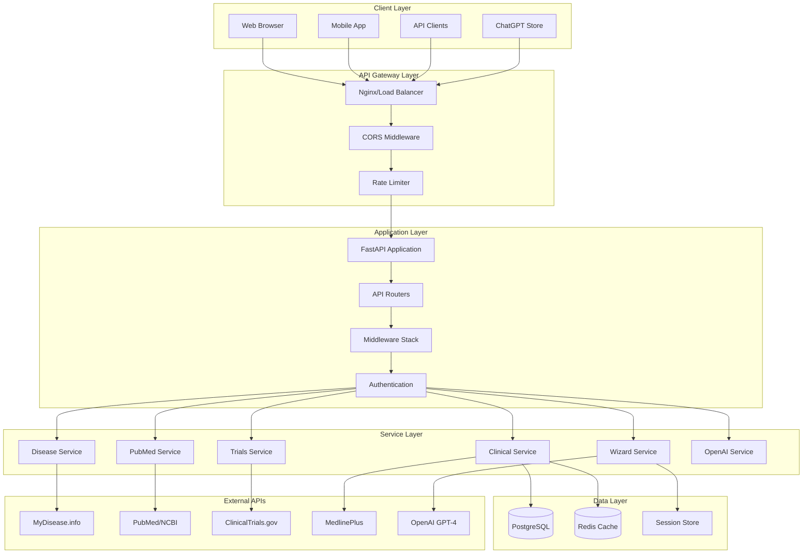
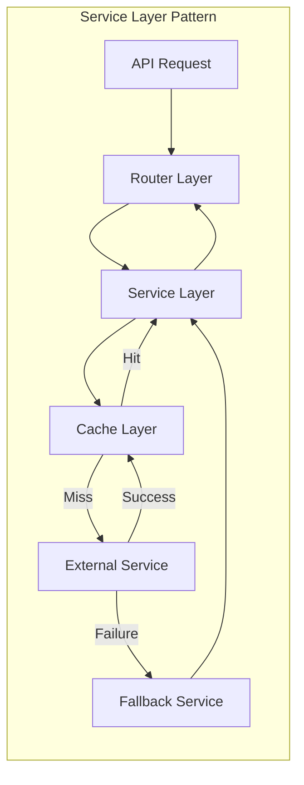
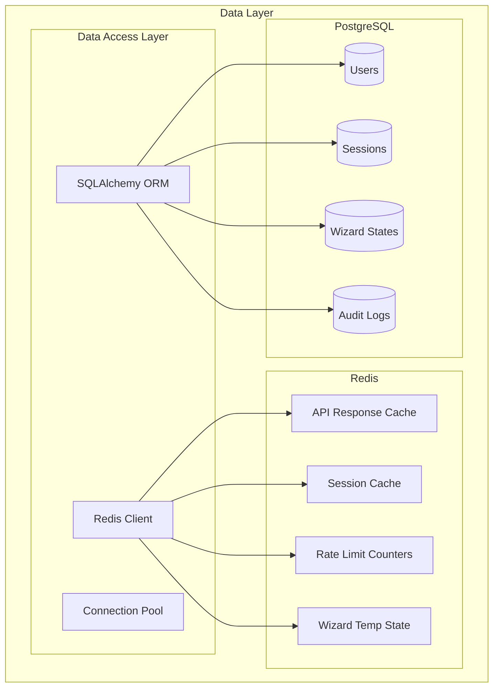
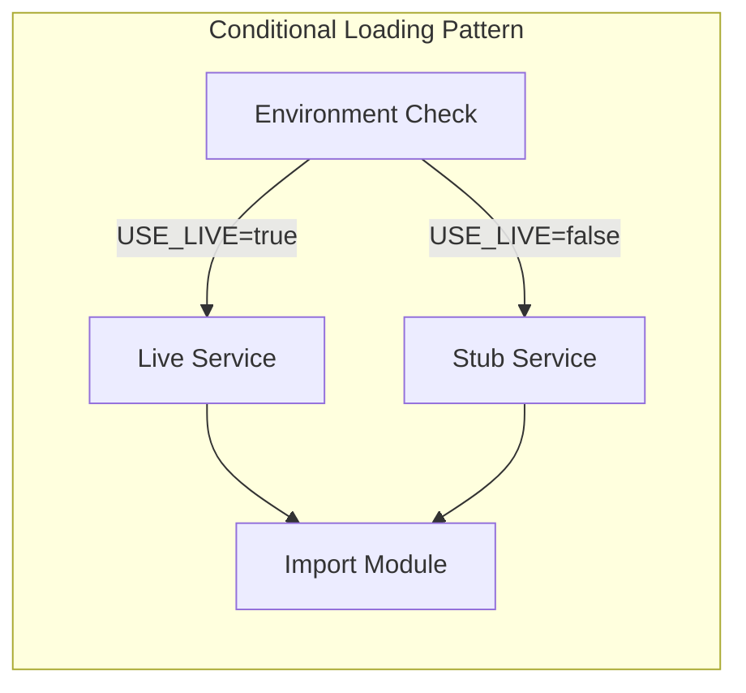
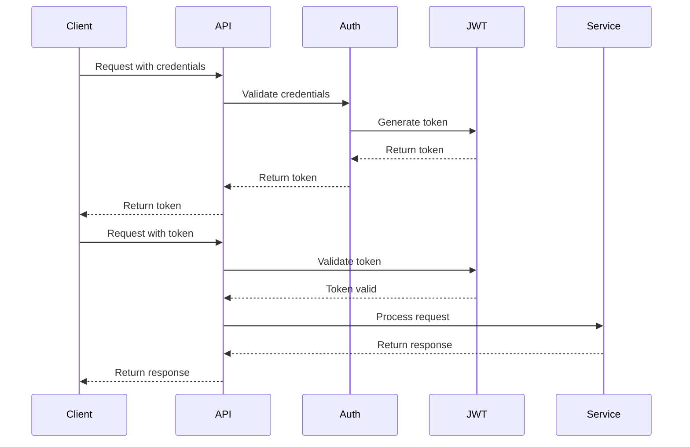
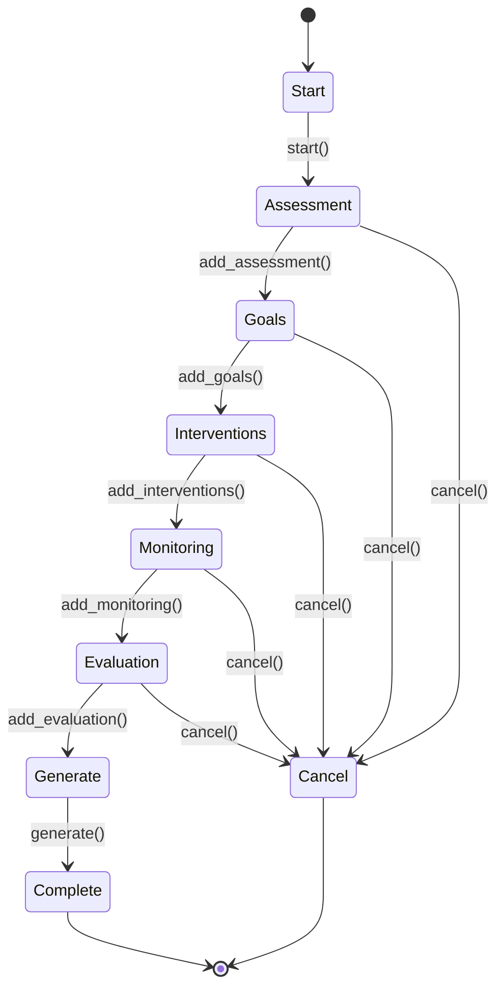
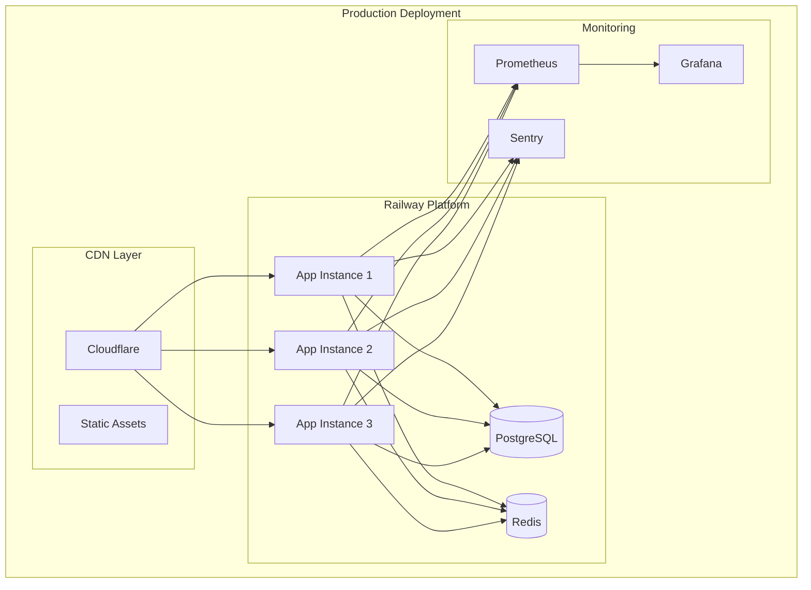
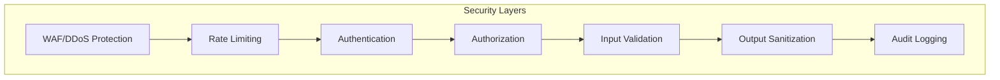
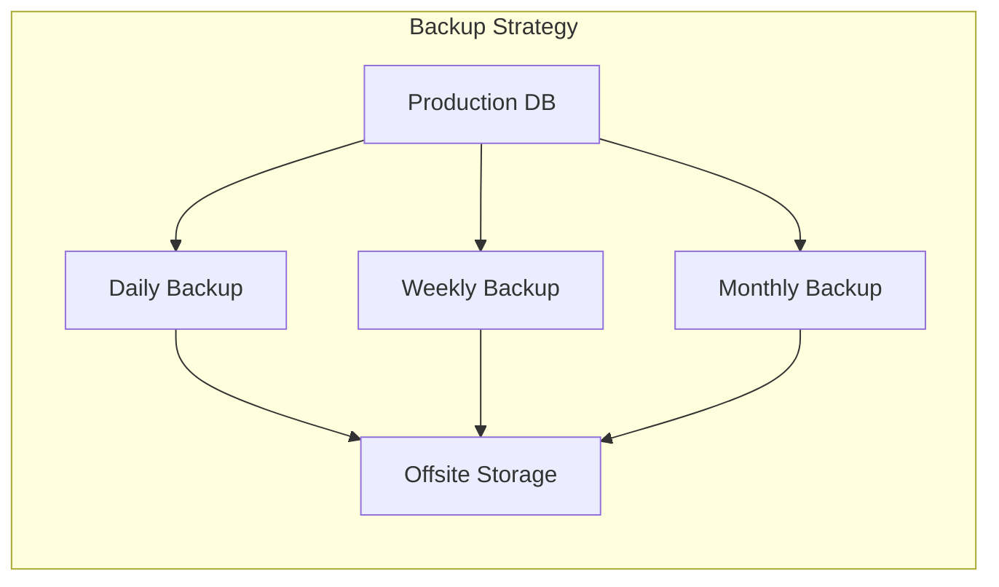

# Architecture Overview
## System Architecture and Component Relationships

## System Overview

AI Nurse Florence is a microservices-ready monolithic application built with FastAPI, designed for healthcare professionals to access evidence-based medical information. The architecture follows Domain-Driven Design principles with clear separation of concerns and service boundaries.

## High-Level Architecture



## Component Architecture

### 1. API Gateway Layer

```python
# nginx.conf architecture
upstream api_backend {
    least_conn;
    server api1:8000 weight=1;
    server api2:8000 weight=1;
    server api3:8000 weight=1;
    
    # Health checks
    health_check interval=5s fails=3 passes=2;
}

server {
    listen 443 ssl http2;
    
    # SSL configuration
    ssl_certificate /etc/nginx/ssl/cert.pem;
    ssl_certificate_key /etc/nginx/ssl/key.pem;
    
    # Security headers
    add_header X-Frame-Options "SAMEORIGIN";
    add_header X-Content-Type-Options "nosniff";
    add_header X-XSS-Protection "1; mode=block";
    
    # Rate limiting zones
    limit_req_zone $binary_remote_addr zone=api:10m rate=60r/m;
    limit_req_zone $binary_remote_addr zone=auth:10m rate=10r/m;
    
    location /api/v1 {
        limit_req zone=api burst=20 nodelay;
        proxy_pass http://api_backend;
    }
}
```

### 2. Application Layer Architecture

```python
# app.py - Main application structure
from fastapi import FastAPI
from fastapi.middleware.cors import CORSMiddleware
from utils.middleware import (
    SecurityHeadersMiddleware,
    RequestIdMiddleware,
    LoggingMiddleware,
    RateLimitMiddleware
)

class Application:
    """
    Main application architecture
    """
    
    def __init__(self):
        self.app = FastAPI(
            title="AI Nurse Florence",
            version="1.0.0",
            docs_url="/docs",
            redoc_url="/redoc"
        )
        self._setup_middleware()
        self._setup_routers()
        self._setup_exception_handlers()
        self._setup_event_handlers()
    
    def _setup_middleware(self):
        """Middleware stack architecture"""
        # Order matters - executed top to bottom for requests
        self.app.add_middleware(SecurityHeadersMiddleware)
        self.app.add_middleware(
            CORSMiddleware,
            allow_origins=get_cors_origins(),
            allow_methods=["*"],
            allow_headers=["*"]
        )
        self.app.add_middleware(RequestIdMiddleware)
        self.app.add_middleware(LoggingMiddleware)
        self.app.add_middleware(RateLimitMiddleware)
    
    def _setup_routers(self):
        """Router architecture with versioning"""
        from routers import api_router_v1
        self.app.include_router(
            api_router_v1,
            prefix="/api/v1"
        )
```

### 3. Service Layer Architecture



#### Service Implementation Pattern

```python
# services/clinical_service.py
from typing import Optional
from utils.cache import cached
from utils.exceptions import ExternalServiceException

class ClinicalService:
    """
    Service layer architecture pattern
    """
    
    def __init__(self):
        self.external_client = self._init_external_client()
        self.cache_client = self._init_cache_client()
        self.fallback_service = self._init_fallback_service()
    
    @cached(ttl_seconds=3600)
    async def get_clinical_data(self, condition: str) -> dict:
        """
        Service method with caching and fallback
        """
        try:
            # Try cache first
            cached_data = await self.cache_client.get(f"clinical:{condition}")
            if cached_data:
                return cached_data
            
            # Call external service
            data = await self.external_client.fetch(condition)
            
            # Cache successful response
            await self.cache_client.set(
                f"clinical:{condition}", 
                data, 
                ttl=3600
            )
            
            return self._add_safety_wrapper(data)
            
        except ExternalServiceException as e:
            # Fallback to stub service
            return await self.fallback_service.get_data(condition)
```

### 4. Data Layer Architecture



#### Database Schema

```python
# models/database.py
from sqlalchemy import Column, String, DateTime, JSON, Integer
from sqlalchemy.ext.declarative import declarative_base

Base = declarative_base()

class User(Base):
    __tablename__ = "users"
    
    id = Column(String, primary_key=True)
    username = Column(String, unique=True, nullable=False)
    role = Column(String, nullable=False)  # RN, NP, MD, Student
    credentials = Column(JSON)  # Professional credentials
    created_at = Column(DateTime)
    last_login = Column(DateTime)

class WizardSession(Base):
    __tablename__ = "wizard_sessions"
    
    wizard_id = Column(String, primary_key=True)
    wizard_type = Column(String, nullable=False)
    user_id = Column(String)
    state = Column(JSON)  # Wizard state data
    completed_steps = Column(JSON)
    created_at = Column(DateTime)
    expires_at = Column(DateTime)

class AuditLog(Base):
    __tablename__ = "audit_logs"
    
    id = Column(Integer, primary_key=True)
    timestamp = Column(DateTime)
    user_id = Column(String)
    action = Column(String)
    resource = Column(String)
    risk_level = Column(String)
    request_id = Column(String)
```

### 5. Caching Architecture

```python
# utils/cache.py - Caching strategy architecture
class CacheArchitecture:
    """
    Multi-tier caching architecture
    """
    
    def __init__(self):
        self.redis_client = self._init_redis()
        self.memory_cache = self._init_memory_cache()
        
    async def get(self, key: str) -> Optional[Any]:
        """
        L1: Memory cache (fastest)
        L2: Redis cache (fast)
        L3: Database (slow)
        """
        # Check L1 cache
        value = self.memory_cache.get(key)
        if value:
            return value
        
        # Check L2 cache
        if self.redis_client:
            value = await self.redis_client.get(key)
            if value:
                # Promote to L1
                self.memory_cache.set(key, value)
                return value
        
        # L3: Will need to fetch from database/external API
        return None
    
    async def set(self, key: str, value: Any, ttl: int = 3600):
        """
        Write-through caching to all tiers
        """
        # Set in L1
        self.memory_cache.set(key, value, ttl=min(ttl, 300))  # Max 5 min in memory
        
        # Set in L2
        if self.redis_client:
            await self.redis_client.setex(key, ttl, value)
```

### 6. External Service Integration Architecture



```python
# Conditional imports architecture
import os

USE_LIVE = os.getenv("USE_LIVE", "false").lower() == "true"

class ServiceLoader:
    """
    Service loading architecture with graceful degradation
    """
    
    @staticmethod
    def load_disease_service():
        try:
            if USE_LIVE:
                from live_mydisease import lookup
                return lookup
            else:
                from stubs.disease_stub import lookup
                return lookup
        except ImportError:
            from fallbacks.disease_fallback import lookup
            return lookup
    
    @staticmethod
    def load_pubmed_service():
        try:
            if USE_LIVE:
                from live_pubmed import search
                return search
            else:
                from stubs.pubmed_stub import search
                return search
        except ImportError:
            from fallbacks.pubmed_fallback import search
            return search
```

### 7. Authentication and Authorization Architecture



### 8. Wizard Pattern Architecture



### 9. Monitoring and Observability Architecture

```python
# monitoring/metrics.py
from prometheus_client import Counter, Histogram, Gauge

class MetricsArchitecture:
    """
    Metrics collection architecture
    """
    
    # Request metrics
    request_count = Counter(
        'http_requests_total',
        'Total HTTP requests',
        ['method', 'endpoint', 'status']
    )
    
    request_duration = Histogram(
        'http_request_duration_seconds',
        'HTTP request latency',
        ['method', 'endpoint']
    )
    
    # Business metrics
    wizard_completions = Counter(
        'wizard_completions_total',
        'Wizard completions',
        ['wizard_type']
    )
    
    external_api_calls = Counter(
        'external_api_calls_total',
        'External API calls',
        ['service', 'status']
    )
    
    # System metrics
    active_sessions = Gauge(
        'active_sessions',
        'Number of active sessions'
    )
    
    cache_hit_ratio = Gauge(
        'cache_hit_ratio',
        'Cache hit ratio',
        ['cache_type']
    )
```

### 10. Deployment Architecture



## Scalability Considerations

### Horizontal Scaling Strategy
```yaml
# kubernetes/deployment.yaml
apiVersion: apps/v1
kind: Deployment
metadata:
  name: ai-nurse-florence
spec:
  replicas: 3
  strategy:
    type: RollingUpdate
    rollingUpdate:
      maxSurge: 1
      maxUnavailable: 0
  template:
    spec:
      containers:
      - name: api
        resources:
          requests:
            memory: "512Mi"
            cpu: "250m"
          limits:
            memory: "1Gi"
            cpu: "500m"
        livenessProbe:
          httpGet:
            path: /api/v1/health
        readinessProbe:
          httpGet:
            path: /api/v1/health
```

### Database Connection Pooling
```python
# database/connection.py
from sqlalchemy.pool import QueuePool

engine = create_engine(
    DATABASE_URL,
    poolclass=QueuePool,
    pool_size=20,          # Number of connections
    max_overflow=40,       # Maximum overflow connections
    pool_pre_ping=True,    # Test connections
    pool_recycle=3600     # Recycle connections hourly
)
```

## Security Architecture

### Defense in Depth


## Performance Optimization

### Request Processing Pipeline
```python
# Performance optimization architecture
class OptimizedPipeline:
    """
    Request processing optimization
    """
    
    async def process_request(self, request):
        # 1. Check cache (1-5ms)
        cached = await check_cache(request)
        if cached:
            return cached
        
        # 2. Validate input (5-10ms)
        validated = validate_input(request)
        
        # 3. Check rate limits (1-2ms)
        if not check_rate_limit(request):
            raise RateLimitException()
        
        # 4. Process business logic (variable)
        result = await process_business_logic(validated)
        
        # 5. Cache result (1-2ms)
        await cache_result(result)
        
        # 6. Return response
        return result
```

## Disaster Recovery Architecture

### Backup and Recovery Strategy


## Technology Stack Summary

| Layer | Technology | Purpose |
|-------|------------|---------|
| **Load Balancer** | Nginx/Railway | Traffic distribution, SSL termination |
| **API Framework** | FastAPI 0.104+ | High-performance async API |
| **Language** | Python 3.11+ | Type hints, async/await |
| **Database** | PostgreSQL 15+ | Primary data store |
| **Cache** | Redis 7+ | Caching and sessions |
| **Search** | PostgreSQL FTS | Full-text search |
| **Queue** | Redis/Celery | Background tasks |
| **Monitoring** | Prometheus/Grafana | Metrics and dashboards |
| **Logging** | JSON/ELK Stack | Structured logging |
| **Container** | Docker | Containerization |
| **Orchestration** | Kubernetes/Railway | Container orchestration |
| **CI/CD** | GitHub Actions | Automated deployment |

---

**Architecture Version**: 2.0.0  
**Last Updated**: September 2025  
**Review Cycle**: Quarterly
